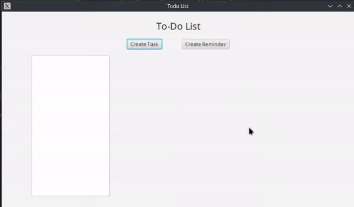
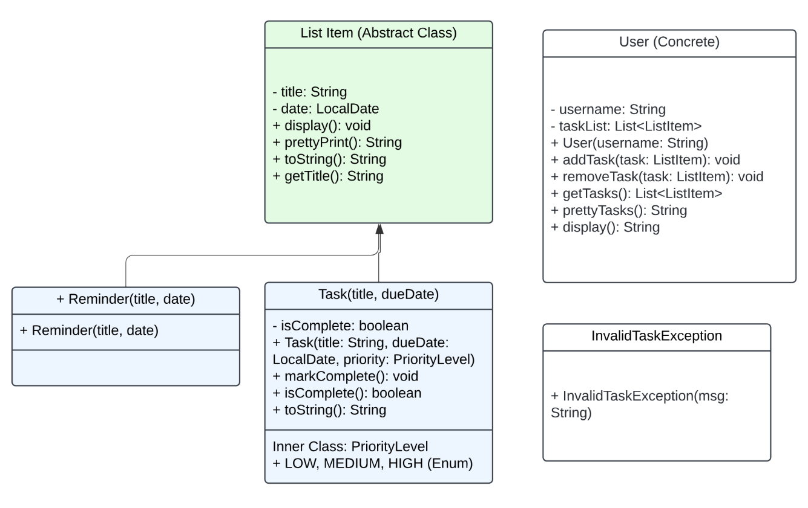
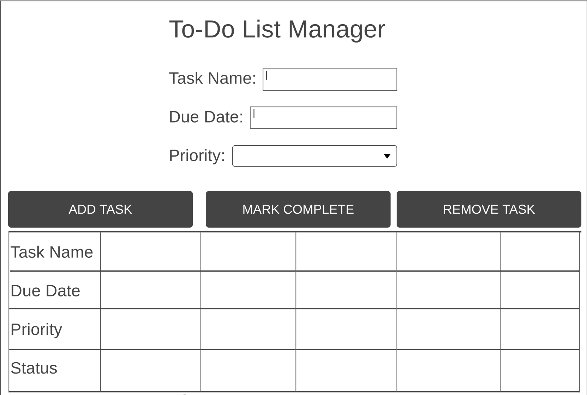

# To-Do List Manager

The **To-Do List Manager** is a graphical Java application designed to help users efficiently manage their tasks.
With features like task prioritization, and an intuitive user interface, this project is inspired by the need for better time management tools in daily life. This project draws inspiration from popular productivity apps like Todoist and Microsoft To-Do while being tailored for simplicity and ease of use. It was initially designed to fulfill academic requirements and evolved into a proof-of-concept application showcasing object-oriented programming principles.

## Features

- Add reminders and tasks dynamically.
- Track task priority and due dates.
- Minimalist and user-friendly GUI layout.

## Inspiration

This project was inspired by:
- The article [*"How to-do lists help boost productivity"*](https://www.notion.com/blog/to-dos) on productivity habits.
- Personal experiences with the challenges of juggling academic and extracurricular responsibilities.
- The structure of popular productivity tools such as Todoist and Trello.

## GIF Demonstration

Here’s a GIF of the working project:


## UML Diagram (UD1)

The following UML diagram outlines the structure and relationships of the core classes used in this project:


## GUI Wireframe Diagram (UD2)

Below is the wireframe diagram created during the planning phase of the graphical user interface:


---

## How to Use
1. Clone the repository to your local machine:
   ```bash
   git clone https://github.com/MiraCosta-Varga/cs112-ud3-final-project-commonkestrel.git
   ```
2. Open the project in IntelliJ IDEA as a Maven project
3. Run the `Main.java` file